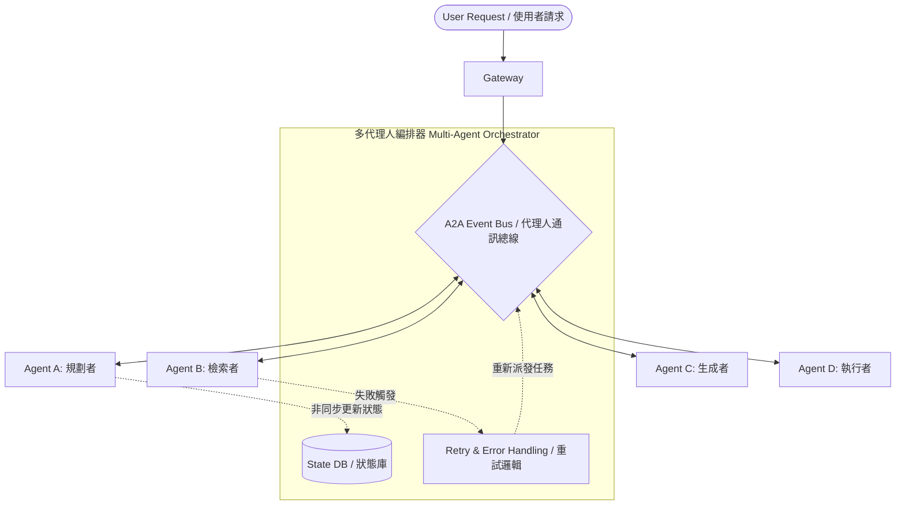
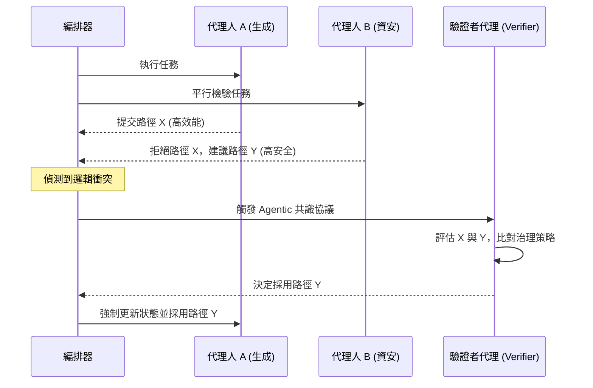

# 2026 AI 代理人編排與協作 (Agentic Orchestration) 深度架構白皮書

**作者：** 矽谷頂尖 Agentic 系統架構師  
**日期：** 2026 年 3 月  
**領域：** 多代理人作業系統 (Multi-Agent Operating System)

## 執行摘要 (Executive Summary)

隨著人工智慧從單一大型語言模型（LLM）走向多模型協同作業，我們在 2026 年正式迎來了「多代理人作業系統（Multi-Agent Operating System）」的時代。在複雜的企業級任務中，單一代理人已無法滿足高可靠度與多領域專業的需求。本白皮書將從矽谷最前沿的架構視角，深入剖析 AI 代理人編排（Agent Orchestration）的四大核心支柱：**異步網格架構 (Asynchronous Mesh)**、**動態能力發現 (Dynamic Discovery)**、**代理人共識協議 (Agentic Consensus Protocols)** 以及 **上下文壓縮 (Context Compaction)**。

---

## 1. 從線性鏈式到異步網格 (Mesh) 的架構演進

### 1.1 傳統線性鏈式的瓶頸
在 2024 至 2025 年間，早期的代理人工作流程主要依賴「線性鏈式（Linear Chains）」架構，即任務從 Agent A 處理完畢後，單向傳遞給 Agent B（Agent A -> Agent B）。這種架構的致命缺點在於：
1.  **單點故障與阻塞：** 一旦鏈條中的某個代理人發生延遲或錯誤，整個流程便會停滯。
2.  **缺乏彈性：** 任務路徑在編譯期（Compile-time）或初始化時就已寫死，無法根據運行時（Runtime）的上下文動態調整。

### 1.2 2026 年的異步網格 (Asynchronous Mesh) 架構
到了 2026 年，AI 工作流程已經全面演進為「非同步的網格網路（Asynchronous Mesh Networks）」。在這種架構下，代理人不再是孤立的節點，而是以微服務（Microservices）的形式存在於一個高度互聯的網格中。

為了支撐這種網格網路，我們引入了「多代理人編排器（Multi-Agent Orchestrator）」。這個編排器的核心職責包括：
*   **狀態管理 (State Management)：** 追蹤全局與局部任務狀態，確保非同步操作的最終一致性。
*   **重試邏輯 (Retry Logic)：** 當某個代理人因為 API 限制或幻覺失敗時，自動執行退避與重試。
*   **代理人間通訊 (A2A, Inter-agent Communication)：** 提供標準化的事件總線（Event Bus）與訊息佇列，讓任何代理人都能互相對話。

### 1.3 網格架構流程圖 (Mermaid)



---

## 2. 動態能力發現 (Dynamic Discovery) 的技術細節

在龐大的網格網路中，代理人需要能夠在沒有人類介入的情況下自主尋找合作夥伴。這催生了「動態能力發現」機制的誕生。

### 2.1 能力元數據 (Capability Metadata)
每一個部署到網格中的代理人，都必須宣告其「能力元數據（Capability Metadata）」。這些元數據具備語義化的特徵，讓其他 AI 代理人能夠「讀懂」並決定是否調用。元數據通常包含代理人的專長領域、輸入輸出格式、預期延遲以及成本。

### 2.2 運行時發現與無人為干預委派
當 Agent A 遇到一個超出其能力的子任務時，它可以透過編排器在運行時（Runtime）動態發現具備相應能力的 Agent B，並直接將任務委派（Delegate）出去，完全不需要人類工程師的介入。

### 2.3 成本協商與 x402 協議
在 2026 年，代理人間在委派任務前，會使用名為 `x402` 的協議來協商運算成本。x402 協議允許代理人根據當前 Token 消耗、GPU 負載以及任務緊急程度進行動態定價報價。

### 2.4 實戰代碼範例：動態發現與 x402 協商 (Python)

```python
import asyncio
from typing import List, Dict, Optional

class CapabilityMetadata:
    def __init__(self, agent_id: str, skills: List[str], base_cost_per_token: float):
        self.agent_id = agent_id
        self.skills = skills
        self.base_cost_per_token = base_cost_per_token

class AgentRegistry:
    def __init__(self):
        self._registry: Dict[str, CapabilityMetadata] = {}

    def announce_capability(self, metadata: CapabilityMetadata):
        self._registry[metadata.agent_id] = metadata
        print(f"[Registry] Agent {metadata.agent_id} announced skills: {metadata.skills}")

    def discover_agents(self, required_skill: str) -> List[CapabilityMetadata]:
        return [meta for meta in self._registry.values() if required_skill in meta.skills]

async def negotiate_x402(client_agent: str, service_agent: CapabilityMetadata, task_complexity: int) -> bool:
    estimated_cost = service_agent.base_cost_per_token * task_complexity
    print(f"[x402 Protocol] {client_agent} is negotiating with {service_agent.agent_id}. Est. cost: {estimated_cost}")
    
    budget_limit = 50.0
    if estimated_cost <= budget_limit:
        print(f"[x402 Protocol] Negotiation SUCCESS. Cost {estimated_cost} accepted.")
        return True
    return False

async def runtime_delegation_demo():
    registry = AgentRegistry()
    registry.announce_capability(CapabilityMetadata("Agent_DataPro", ["data_analysis", "sql"], 1.5))
    registry.announce_capability(CapabilityMetadata("Agent_CheaperPro", ["data_analysis"], 0.8))

    print("\n--- 任務開始：Agent_Main 需要進行數據分析 ---")
    candidates = registry.discover_agents("data_analysis")
    
    for candidate in candidates:
        success = await negotiate_x402("Agent_Main", candidate, task_complexity=40)
        if success:
            print(f"[Delegation] Task successfully delegated to {candidate.agent_id} without human intervention!")
            break
```

---

## 3. Agentic 共識協議如何解決邏輯衝突 (Governance & Consensus)

### 3.1 為什麼需要治理與共識？
想像一個軟體開發場景：撰寫程式碼的代理人認為某個演算法最優，但負責資安掃描的代理人認為該演算法存在漏洞風險。2026 年的系統導入了完善的「治理與共識（Governance & Consensus）」機制來解決這個問題。

### 3.2 代理人共識協議 (Agentic Consensus Protocols)
當衝突發生時，系統會觸發「代理人共識協議」來決定最終的輸出結果：

1.  **多數決 (Majority Vote)：** 
    系統會動態生成多個具備相同能力的代理人副本，讓他們對爭議點進行獨立評估並投票。
2.  **驗證者代理 (Verifier Agent)：** 
    這是一種更高權限的監督節點。其唯一職責是根據預設的治理準則（如安全性優先、效能優先）來裁定誰的輸出才是最終結果。

### 3.3 共識協議架構圖 (Mermaid)



---

## 4. 上下文壓縮 (Context Compaction) 的資源管理優化

### 4.1 上下文預算 (Context Budget) 的挑戰
嚴格管理「上下文預算（Context Budget）」是系統架構中的關鍵挑戰。

### 4.2 上下文壓縮 (Context Compaction) 的運作機制
為了解決預算問題，網格中的代理人必須具備「上下文壓縮（Context Compaction）」的能力。代理人必須主動將冗長的歷史紀錄「摘要」並提煉成高密度的資訊區塊（包含狀態機快照、知識圖譜局部萃取等）。

### 4.3 實戰代碼範例：上下文壓縮 (Python)

```python
import json

class ContextManager:
    def __init__(self, context_budget: int):
        self.history = []
        self.context_budget = context_budget
        
    def add_event(self, event: str):
        self.history.append(event)
        
    def estimate_tokens(self) -> int:
        return sum(len(e.split()) for e in self.history)

class ContextCompactor:
    @staticmethod
    def compact_context(raw_history: list) -> str:
        print(f"[Compaction] 正在壓縮 {len(raw_history)} 條歷史紀錄...")
        summary = {
            "key_decisions": ["Task identified as Data Analysis", "Database connected successfully"],
            "pending_issues": ["Missing user_id field in table A"],
            "compressed_at": "2026-03-03"
        }
        return json.dumps(summary)

def agent_handoff_demo():
    manager = ContextManager(context_budget=500)
    for i in range(1, 51):
        manager.add_event(f"Step {i}: Analyzed row {i}, no anomalies found.")
        
    current_tokens = manager.estimate_tokens()
    if current_tokens >= manager.context_budget:
        compressed_state = ContextCompactor.compact_context(manager.history)
        print(f"壓縮後的狀態: \n{compressed_state}")
```

---

## 5. 總結與未來展望

2026 年的 AI 代理人編排技術，透過**動態發現**與 **x402 協商協議**賦予了代理人自治權，透過**驗證者代理與多數決**的共識協議確保了系統的穩健治理，並運用**上下文壓縮**完美地控制了資源預算。

身為架構師，深刻理解並實作這四大支柱，是構建下一代具備高擴展性、高容錯性之「多代理人作業系統（Multi-Agent OS）」的唯一途徑。
