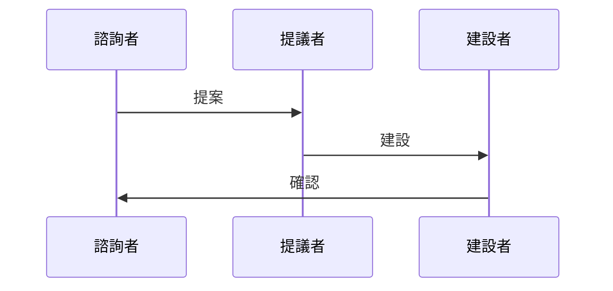

# 2026 公鏈底層架構技術白皮書

## 引言
在全球公鏈技術日新月異的背景下，2026年的公鏈架構不僅要具備高效的性能，還需在共識機制、新的計算模型和數據可用性等方面展現出無與倫比的優勢。本白皮書的核心在於深度分析「公鏈底層架構」，特別著重於以下幾個重要領域：並行執行、MEV與排序器架構、數據可用性層的比較，以及提供實戰的範例與代碼實現。  

## 一、Parallel Execution 深度解析
### 1.1 Optimistic Concurrency Control (OCC) 與 Deterministic Scheduling
在Monad的系統中，OCC和Deterministic Scheduling的概念緊密結合。OCC允許多個交易同時進行，這是通過一種樂觀的方式來處理競爭條件，即在不鎖定資源的情況下，進行隨後的驗證。一旦交易被執行，系統將執行狀態的確認，這樣可以最大化吞吐量。

另一方面，Deterministic Scheduling則確保每個交易的執行順序是可預測的。這一進一步的安排使得系統在面對大型交易流量時，能夠確保一致性和穩定性。  

#### 1.1.1 OCC 的具體實作
在Monad的實作中，OCC的使用涉及到以下幾個關鍵步驟：
1. 在交易開始時，系統只做最小的資源鎖定。
2. 當交易完成時，對所有需要的資源進行驗證。
3. 若發現衝突，則中止部分交易並進行重試；若無衝突，則提交所有改變。
   
這一方法不僅提升了交易的發揮量，還減少了因為鎖定而造成的資源浪費。  

### 1.2 Pipelined Consensus 的微秒級延遲分析
Pipelined Consensus是通過模塊化的設計減少延遲的。此共識機制允許不同的共識階段（如提議、投票、確認）在時序上重疊，從而提高效率。  

#### 1.2.1 分層通信
文件的基本結構通常包含多層級的通訊協議。這些層級架構可以在協議中引入訂閱和隨選數據傳輸，減少了傳輸過程中的延遲，並更好地支持微秒級的性能要求。不同的層級專注於不同的傳輸需求，根據實際的網絡狀況調整傳輸速率，確保信息能夠在最短的時間內傳遞到需要的節點。

## 二、MEV 與排序器架構
### 2.1 Proposer-Builder Separation (PBS) 的演進
2026年出現了一個新模式，即Proposer-Builder Separation (PBS)，這一結構確保了提議者專注於交易的有效性，而不是將其與建設過程混合。這意味著，專注於不同職能的隊伍能夠在不同的時間進行優化。  

## 2.2 共享排序器 (Shared Sequencers) 與 Atomic Bundle
共享排序器作為一種新興的結構，有望透過Atomic Bundle技術來解決流動性碎片化問題。此一技術的核心在於將多個交易集成在一個原子交易中執行，因此不僅提升了效率，也能夠同時進行流動性管理，最大的降低了跨鏈操作中存在的風險。

## 三、DA (數據可用性) 層對比
### 3.1 Celestia的 2D Data Availability Sampling (DAS)  
Celestia的DAS是一種全新的數據可用性取樣，它以二維的方式提升了數據檢測的準確度，具有更好的擴展性。相比於傳統的取樣方法，DAS能夠更快地識別是否所有的數據都可用。  

### 3.2 EigenDA的 KZG Commitment
而EigenDA則利用KZG Commitment技術，通過多邊形承諾的方式實現數據的可用性。這一技術則在問責制上提供了更強的保障，使得驗證過程能夠進一步加速並且提升了安全性。  

## 四、實戰代碼與圖表
### 4.1 Rust 代碼
```rust
// 並行執行的基本任務調度器
struct TaskScheduler {
    tasks: Vec<Task>,
}

impl TaskScheduler {
    fn new() -> Self {
        TaskScheduler { tasks: Vec::new() }
    }

    fn schedule_task(&mut self, task: Task) {
        self.tasks.push(task);
    }

    fn execute(&self) {
        for task in &self.tasks {
            // 執行任務的邏輯
            task.run();
        }
    }
}
```

### 4.2 Mermaid 圖表


## 結語
本白皮書探討了2026年公鏈底層架構的重要技術，從並行執行深度解析到MEV與排序器架構，再到數據可用性層的深入對比，每一個部分都突顯出業界的創新努力和未來發展的趨勢。希望能為公鏈的技術進步貢獻一份力量。

## 引言
在全球公鏈技術日新月異的背景下，2026年的公鏈架構不僅要具備高效的性能，還需在共識機制、新的計算模型和數據可用性等方面展現出無與倫比的優勢。本白皮書的核心在於深度分析「公鏈底層架構」，特別著重於以下幾個重要領域：並行執行、MEV與排序器架構、數據可用性層的比較，以及提供實戰的範例與代碼實現。  

## 一、Parallel Execution 深度解析
### 1.1 Optimistic Concurrency Control (OCC) 與 Deterministic Scheduling
在Monad的系統中，OCC和Deterministic Scheduling的概念緊密結合。OCC允許多個交易同時進行，這是通過一種樂觀的方式來處理競爭條件，即在不鎖定資源的情況下，進行隨後的驗證。一旦交易被執行，系統將執行狀態的確認，這樣可以最大化吞吐量。

另一方面，Deterministic Scheduling則確保每個交易的執行順序是可預測的。這一進一步的安排使得系統在面對大型交易流量時，能夠確保一致性和穩定性。  

#### 1.1.1 OCC 的具體實作
在Monad的實作中，OCC的使用涉及到以下幾個關鍵步驟：
1. 在交易開始時，系統只做最小的資源鎖定。
2. 當交易完成時，對所有需要的資源進行驗證。
3. 若發現衝突，則中止部分交易並進行重試；若無衝突，則提交所有改變。
   
這一方法不僅提升了交易的發揮量，還減少了因為鎖定而造成的資源浪費。  

### 1.2 Pipelined Consensus 的微秒級延遲分析
Pipelined Consensus是通過模塊化的設計減少延遲的。此共識機制允許不同的共識階段（如提議、投票、確認）在時序上重疊，從而提高效率。  

#### 1.2.1 分層通信
文件的基本結構通常包含多層級的通訊協議。這些層級架構可以在協議中引入訂閱和隨選數據傳輸，減少了傳輸過程中的延遲，並更好地支持微秒級的性能要求。不同的層級專注於不同的傳輸需求，根據實際的網絡狀況調整傳輸速率，確保信息能夠在最短的時間內傳遞到需要的節點。

## 二、MEV 與排序器架構
### 2.1 Proposer-Builder Separation (PBS) 的演進
2026年出現了一個新模式，即Proposer-Builder Separation (PBS)，這一結構確保了提議者專注於交易的有效性，而不是將其與建設過程混合。這意味著，專注於不同職能的隊伍能夠在不同的時間進行優化。  

## 2.2 共享排序器 (Shared Sequencers) 與 Atomic Bundle
共享排序器作為一種新興的結構，有望透過Atomic Bundle技術來解決流動性碎片化問題。此一技術的核心在於將多個交易集成在一個原子交易中執行，因此不僅提升了效率，也能夠同時進行流動性管理，最大的降低了跨鏈操作中存在的風險。

## 三、DA (數據可用性) 層對比
### 3.1 Celestia的 2D Data Availability Sampling (DAS)  
Celestia的DAS是一種全新的數據可用性取樣，它以二維的方式提升了數據檢測的準確度，具有更好的擴展性。相比於傳統的取樣方法，DAS能夠更快地識別是否所有的數據都可用。  

### 3.2 EigenDA的 KZG Commitment
而EigenDA則利用KZG Commitment技術，通過多邊形承諾的方式實現數據的可用性。這一技術則在問責制上提供了更強的保障，使得驗證過程能夠進一步加速並且提升了安全性。  

## 四、實戰代碼與圖表
### 4.1 Rust 代碼
```rust
// 並行執行的基本任務調度器
struct TaskScheduler {
    tasks: Vec<Task>,
}

impl TaskScheduler {
    fn new() -> Self {
        TaskScheduler { tasks: Vec::new() }
    }

    fn schedule_task(&mut self, task: Task) {
        self.tasks.push(task);
    }

    fn execute(&self) {
        for task in &self.tasks {
            // 執行任務的邏輯
            task.run();
        }
    }
}
```

### 4.2 Mermaid 圖表


## 結語
本白皮書探討了2026年公鏈底層架構的重要技術，從並行執行深度解析到MEV與排序器架構，再到數據可用性層的深入對比，每一個部分都突顯出業界的創新努力和未來發展的趨勢。希望能為公鏈的技術進步貢獻一份力量。