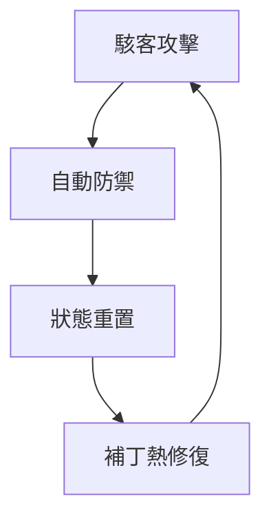

# 2026 智能合約安全與自癒架構技術白皮書

## 目錄
1. 引言  
2. 形式化驗證  
   2.1 SMT Solvers 與 Symbolic Execution  
   2.2 Foundry/Solidity 或 Certora 規範代碼  
3. 自癒型合約  
   3.1 動態斷路器  
   3.2 Runtime Verification  
4. 量子抗性  
   4.1 Lamport Signatures 與 Dilithium  
5. 實戰代碼與圖表  
   5.1 合約安全設計範例  
   5.2 Mermaid 圖表  
6. 結論  

---  

## 1. 引言
隨著區塊鏈技術的快速發展，智能合約已成為最受歡迎的應用之一。但隨著使用的增加，合約安全問題也變得日漸嚴重。本白皮書旨在探索2026年智能合約的安全性問題，及如何實現自癒架構來減輕潛在的風險。

## 2. 形式化驗證
形式化驗證是一種用數學方法來證明軟件或硬件系統的正確性的方法。在智能合約安全中，這意味著使用工具來確保合約的邏輯完全符合預期。  

### 2.1 SMT Solvers 與 Symbolic Execution
**SMT Solvers**（如 Z3）和**Symbolic Execution**是兩種主要的形式化驗證技術。  
- **SMT Solvers**能夠快速找到合約中的邏輯錯誤。透過將邏輯表達式轉換為可解的數學形式，這些解算器能驗證合約中定義的條件是否為真。  
- **Symbolic Execution**則是使用符號變數模擬合約的執行過程，遍歷所有可能的計算分支，以確保每種情況都被考慮到。  

### 2.2 Foundry/Solidity 或 Certora 規範代碼
以下是一段基於Foundry/Solidity的簡單代碼示例，以展示如何定義不變量：  
```solidity
pragma solidity ^0.8.0;

contract SampleContract {
    uint256 invariant count;
    
    constructor() {
        count = 0;
    }
    
    function increment() public {
        count += 1;
        assert(count > 0);
    }
}
```  
這段代碼展示了如何使用不變量來確保合約中的計數器永遠大於零。

## 3. 自癒型合約
自癒型合約的核心目標是減少合約執行過程中的風險和損失。  

### 3.1 動態斷路器
動態斷路器是一種新的安全機制，能在檢測到異常流出時自動鎖定資金。這些斷路器通過AI技術運作，能夠實時監控合約的運行狀態，確保任何不規則操作都能及時被偵測。

### 3.2 Runtime Verification
**Runtime Verification**是一種在合約運行期間攔截狀態的技術。這允許開發者在合約發生意外的狀態變更時進行即時干預，從而防止進一步的損害。

## 4. 量子抗性
隨著量子計算的發展，傳統的加密技術可能面臨破壞性攻擊。因此，量子抗性技術的重要性日漸凸顯。

### 4.1 Lamport Signatures 與 Dilithium
- **Lamport Signatures**提供了一種基於單向函數的簽名方法，十分適合用於量子抗性防護。  
- **Dilithium**是一種新興的量子安全簽名方案，能提供強大的數據保護能力。這些技術將作為2026年合約升級的重要組成部分。

## 5. 實戰代碼與圖表
### 5.1 合約安全設計範例
以下是用於展示合約安全性設計的範例代碼：  
```solidity
pragma solidity ^0.8.0;

contract SecureContract {
    address public owner;
    mapping (address => uint256) public balances;
    
    modifier onlyOwner() {
        require(msg.sender == owner, "Not the owner");
        _;
    }
    
    constructor() {
        owner = msg.sender;
    }
    
    function deposit() public payable {
        balances[msg.sender] += msg.value;
    }
    
    function withdraw(uint256 amount) public onlyOwner {
        require(balances[msg.sender] >= amount, "Insufficient balance");
        balances[msg.sender] -= amount;
        payable(msg.sender).transfer(amount);
    }
}
```  
### 5.2 Mermaid 圖表
以下是使用Mermaid圖表來展示自癒架構的運作過程：  


## 6. 結論

在本白皮書中，我們深入探討了2026年智能合約的安全性問題及其自癒架構的實現。透過結合形式化驗證、自癒合約技術及量子抗性，加上實戰代碼的展示，我們為未來的智能合約安全提供了一個可行的架構。隨著區塊鏈和智能合約技術的演進，必須持續進行深入的安全研究與技術創新，以應對不斷變化的安全威脅。
隨著智能合約日益普及，安全性問題將使其成為區塊鏈生態系統中的一個關鍵問題。本白皮書提供了對2026年智能合約安全與自癒架構的深入解析，期望為未來的安全技術發展提供指導。