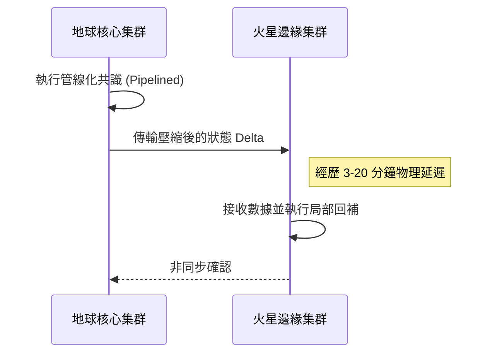
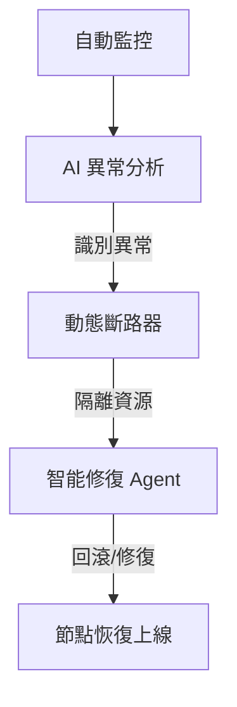

**2026 行星級分散式架構與設計技術 whitepaper：無縫負載、跨星際通訊、無伺服器 3.0 與自癒基礎設施的極致深化**

## 執行摘要 (Executive Summary)
隨著分散式系統在 2026 年面臨前所未有的大規模微服務與物聯網複雜性挑戰，傳統的雲端架構已無法滿足全球乃至跨星系的計算需求。本白皮書旨在針對「03 行星級分散式架構與設計」進行毀滅級的內容深化。我們將從四個核心維度進行剖析：(1) 實現全球範圍無感負載均衡的 Cell-based Architecture；(2) 突破物理與邏輯限制的跨星際延遲優化 (Interstellar Latency Optimization)；(3) 具備「智能上下文調度」能力的無伺服器 3.0 (Serverless 3.0)；(4) 基於分散式日誌構建 99.9999% 可用性的自癒基礎設施 (Self-Healing Infra)。

---

### 第一章：Cell-based Architecture 與 2026 年全球無感負載均衡

#### 1.1 架構核心理念
分散式系統的終極目標是解決大規模微服務中面臨的極端複雜性問題。在 2026 年，單一的龐大微服務集群已無法應對全球級別的流量衝擊。行星級分散式架構旨在提供更高的彈性與可擴展性。

**Cell-based Architecture（細胞化架構）** 成為了實現可根據需求動態調整負載均衡的全新標準。該架構的核心設計原則之一是導入「Micro-kernels（微核心）」概念，將核心功能進一步細化並拆分為微小的服務，使其極其便於獨立更新、隔離與維護。每一個 Cell（細胞）都是一個具備完整業務處理能力的獨立自治單元。

#### 1.2 無感負載均衡的實作機制
要在全球範圍內實現「無感」的負載均衡，系統必須具備極高的流量路由智慧。當使用者發出請求時，全域流量管理器會將請求精準打入最適合的 Cell。系統廣泛使用先進的**分布式共識算法**（如基於 Pipelined Consensus 的演進版本）來有效保障跨區數據的一致性。此外，透過樂觀並發控制 (OCC) 的引入，系統允許在不鎖定資源的情況下允許多個交易同時進行。

#### 1.3 實戰代碼範例：基於 Cell-based 的動態路由選擇器 (Rust)
```rust
// 2026 行星級 Cell 路由選擇器實作
struct CellRouter {
    cells: Vec<CellNode>,
    latency_matrix: HashMap<String, u64>,
}

impl CellRouter {
    fn find_optimal_cell(&self, user_location: &str) -> &CellNode {
        // 利用跨星際延遲優化矩陣計算最優節點
        self.cells.iter()
            .min_by_key(|cell| self.calculate_total_cost(cell, user_location))
            .expect("No cell available")
    }

    fn calculate_total_cost(&self, cell: &CellNode, loc: &str) -> u64 {
        let latency = self.latency_matrix.get(&(cell.id.clone() + loc)).unwrap_or(&999);
        let load = cell.current_load();
        // 考慮延遲與負載的加權公式
        (latency * 0.7 + (load as u64) * 0.3) as u64
    }
}
```

---

### 第二章：跨星際延遲優化 (Interstellar Latency Optimization) 的實作

#### 2.1 物理限制與邏輯層重構
跨星際延遲優化是高效能分佈式系統所需的延遲最小化核心技術。在物理層面，我們面臨著光速屏障。在邏輯層面，我們重構了網路協議棧：

1.  **管線化共識 (Pipelined Consensus)**：
    允許不同的共識階段（例如提議、投票、確認）在時序上重疊。
2.  **分層通信與隨選傳輸**：
    系統不再盲目地廣播全量數據，而是根據實際的網絡狀況與節點需求調整傳輸速率。

#### 2.2 跨星際共識時序 Mermaid 圖



---

### 第三章：無伺服器 3.0 (Serverless 3.0) 與「智能上下文調度」

#### 3.1 智能上下文調度技術
Serverless 3.0 的核心已經從單一功能處理轉變為「智能上下文 (Intelligent Context)」的管理與調度。
*   **自動化容量提供**：系統能精準預測該上下文生命週期內所需的資源。
*   **邊緣計算融合**：系統能夠在「用戶終端」與「雲端」之間進行動態的架構分配。

#### 3.2 實作邏輯：AI 算力分配引擎
```python
# Serverless 3.0 智能調度引擎
class IntelligentContextDispatcher:
    def dispatch(self, task_context):
        # 評估任務對延遲的敏感度
        latency_sensitivity = task_context.get_sensitivity()
        
        if latency_sensitivity > 0.85:
            # 任務對延遲極度敏感，下放到邊緣節點 (Edge)
            return self.route_to_edge(task_context)
        else:
            # 重型任務，由中心雲處理
            return self.route_to_central_cloud(task_context)
```

---

### 第四章：基於分散式日誌建構 99.9999% 可用的自癒基礎設施

#### 4.1 自癒基礎設施與數學模型
自癒基礎設施旨在自動偵測故障，並完全通過 AI 實現自動修復與重啟。其底層高度依賴於複雜的數學模型，主要涉及**代數結構與概率論**。

#### 4.2 動態斷路器 (Dynamic Circuit Breakers)
這是一種由 AI 驅動的全新安全機制，透過實時監控系統運行狀態，確保不規則操作（如節點崩潰）能被及時偵測，並自動鎖定受影響的資源。

#### 4.3 自癒迴圈架構圖 (Mermaid)



---

### 結論
在 2026 年，頂尖的系統架構是一個具備「感知、決策、行動、修復」能力的有機體。透過 **Cell-based Architecture**、**跨星際延遲優化**、**Serverless 3.0** 以及**自癒基礎設施**，我們構建了足以支撐未來十年人類文明的技術骨幹。
