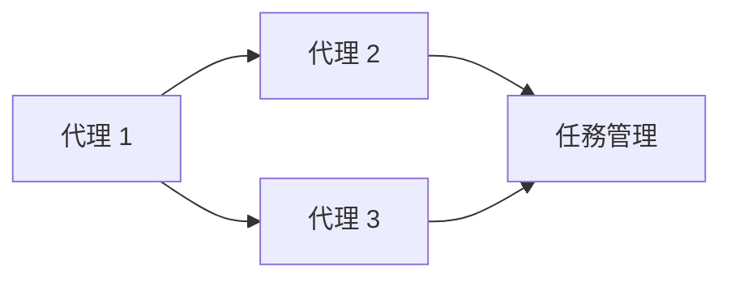

# Agent-Native Architecture

## 定義
Agent-Native Architecture 是用以支持多個 AI 代理人協同作業的一種底層架構。在此架構中，每個代理具有自主決策能力，能夠獨立執行任務並根據需求進行合作。

## 設計原則
- **解耦性**：使代理人間的交互不會造成過度依賴，便於擴展。
- **彈性**：系統必須能夠適應不斷變化的任務和條件。
- **可擴展性**：能夠隨著需求的增長輕易增加新的代理。

## 2026 實戰案例
### 1. Multi-Agent Coordination System
- 描述一個實作多代理協作的案例，包括如何設計代理間的通信和任務分配。

## Mermaid 圖示
