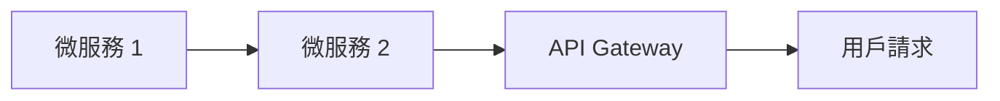

# 分散式系統的新標竿

## 定義
分散式系統的目標是解決大規模微服務中面臨的複雜性問題。

## 設計原則
- **Micro-kernels**：將核心功能分成微小的服務，便於更新和維護。
- **Serverless v2**：實現更有效率的資源管理，無需關心底層基礎建設。
- **Cell-based Architecture**：實現可根據需求調整的負載均衡。

## 2026 實戰案例
### 2. 微服務架構實作
- 開發一個微服務保險系統的案例，展示如何利用以上原則解決問題。

## Mermaid 圖示
