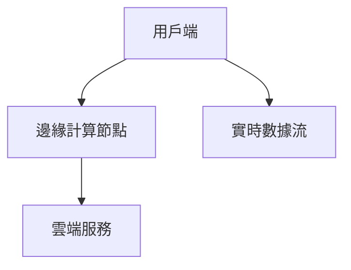

# 邊緣計算與 AI 算力調度

## 定義
隨著 IoT 和 AI 的發展，邊緣計算需要在用戶終端與雲端之間進行動態架構分配。

## 設計原則
- **資料就近處理**：減少延遲，提高響應速度。
- **智能調度**：根據用戶需求動態調整計算能力。

## 2026 實戰案例
### 4. 边缘计算调度系统
- 描述如何實現異地數據處理及智能分析的案例。

## Mermaid 圖示

```mermaid
flowchart TB
    A[用戶端] --> B[邊緣計算節點]
    B --> C[雲端服務]
    A --> D[實時數據流]
```