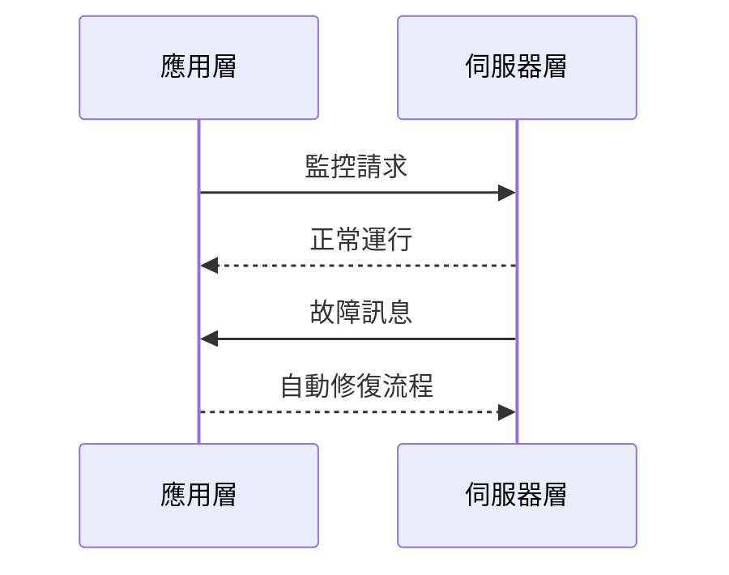

# 自癒基礎設施 (Self-Healing Infra)

## 定義
自癒基礎設施旨在自動偵測故障並通過 AI 實現自動修復與重啟。

## 設計原則
- **自動監控**：持續檢測系統狀態，發現異常。
- **智能修復**：利用 AI 技術自動修復問題，減少人工介入。

## 2026 實戰案例
### 3. 自癒基礎設施實作
- 建立一個能夠自動修復的網絡系統，例如動態調整伺服器。

## Mermaid 圖示
