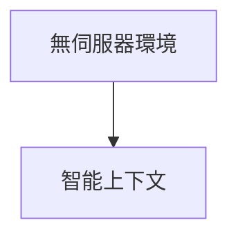

# 無伺服器3.0 (Serverless 3.0)

## 1. 概述  
無伺服器架構的演進，從單一功能轉變為智能上下文。

## 2. 實作步驟  
- 建立無伺服器環境  
- 優化功能和上下文聯結  

## 3. 在2026年的應用  
- 提供自動化容量  
- 增強上雲應用的可擴展性  

```mermaid
graph TD;
    A[無伺服器環境] --> B[智能上下文]
```