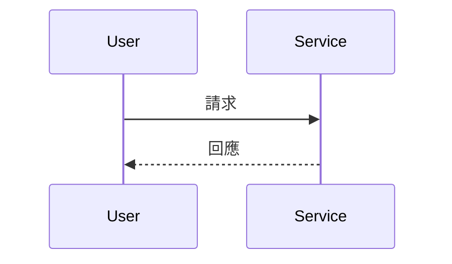

# 跨星際延遲優化 (Interstellar Latency Optimization)

## 1. 概述  
為高效能分佈式系統所需的延遲最小化技術。

## 2. 實作步驟  
- 確定延遲源並分析  
- 優化數據傳輸路徑  

## 3. 在2026年的應用  
- 保障跨星際通訊的即時性  

```mermaid
sequenceDiagram
    participant User
    participant Service
    User->>Service: 請求
    Service-->>User: 回應
```