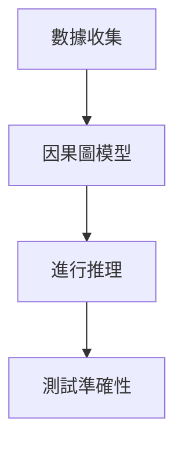

# 因果推理架構 (Causal Inference Architecture)

## 1. 概述  
因果推理架構是通過分析資料中變數之間的因果關係，讓系統能夠進行預測。這種架構需要充分的數據和合適的模型來訓練。

## 2. 實作步驟  
- 收集並準備資料  
- 建立因果圖模型  
- 使用數據進行推理  
- 測試預測準確性  

## 3. 在2026年的應用  
- 提升智能系統的預測能力  
- 提供更可靠的決策支持  

