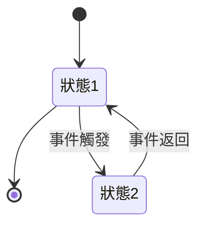

# 自主狀態機 (Autonomous State Machines)

## 1. 概述  
自主狀態機在複雜的非同步環境中，維持邏輯的一致性。它們基於當前狀態及外部輸入自動轉換狀態。

## 2. 實作步驟  
- 定義可能的狀態  
- 設置過渡邏輯  
- 測試並優化狀態轉換  

## 3. 在2026年的應用  
- 自主系統的邏輯調整  
- 強化多Agent環境中的協調能力  

