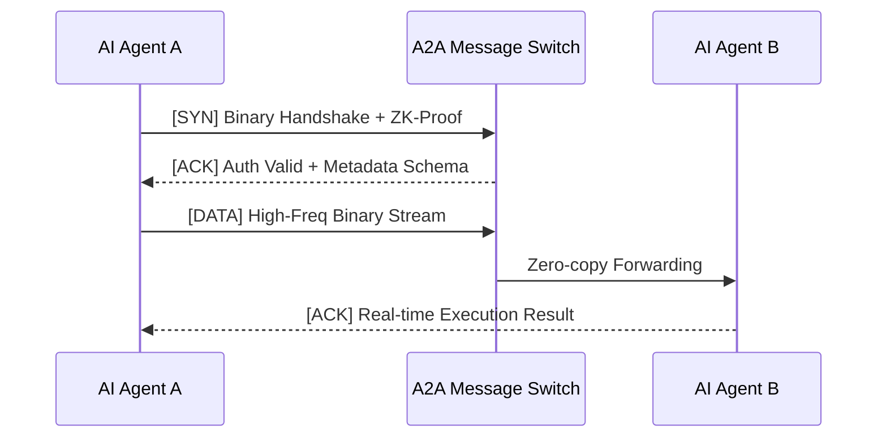

# 2026 終極技術白皮書：04 API 與 A2A 通訊協議標準深度解析

身為頂尖 API 工程師與通訊協議專家，我將為您深度拆解 2026 年最新的「04 API & A2A 通訊協議標準」。我們將從底層二進制流傳輸、HATEOAS 2.0 自主發現、ZK-Auth 安全防禦以及高性能訊息交換中心的實作四個維度進行剖析。

---

### 第一章：A2A 協議的底層握手與二進制流 (Binary Streams) 實作

在 2026 年，AI 代理人之間的通訊已經發生了典範轉移。AI 代理人之間的通訊將不再依賴傳統的 JSON 格式，取而代之的是一種新的二進制流 (Binary Streams) 協議。

#### 1.1 傳統 JSON 的終結與二進制流的崛起
傳統 API 依賴文本格式（如 JSON）進行序列化與反序列化，這在微秒級的 AI 決策中成為了致命的效能瓶頸。使用二進制流可以大幅減少資料的大小和傳輸時間，這特別適合高頻交易和即時通訊的應用場景。在 A2A 協議中，通訊層被重構為無狀態、零拷貝 (Zero-copy) 的二進制幀 (Binary Frames)。

#### 1.2 底層握手與通訊流程 Mermaid 圖



---

### 第二章：利用 HATEOAS 2.0 實現 AI 代理人的「自主 API 發現與學習」

在多 Agent 共生架構中，系統必須能夠適應不斷變化的任務和條件。傳統 API 需要人類工程師撰寫 SDK 與靜態路由，而在 2026 年，HATEOAS 2.0 旨在讓 AI 代理人能夠自主學習使用新的 API，完全無需人手動調整。

#### 2.1 自主發現流程 (Autonomous Discovery Flow)
1. **資源發現**：代理人通過超媒體格式發現可用的 API 資源。在二進制 A2A 協議中，這透過二進制的「狀態轉換向量」來實現。
2. **自我描述型接口解析**：代理人透過元資料來理解請求格式。讀取二進制 Schema，理解變數類型與長度。
3. **請求形成**：根據發現的資源，代理人動態生成符合二進制規範的請求。這依賴於自主狀態機，維持邏輯的一致性。

---

### 第三章：2026 年基於 ZK-Auth 的動態流控與 API 安全防禦

保障 API 使用安全性變得更加重要，特別是必須面對惡意 AI 的自動化威脅。

#### 3.1 ZK-Auth (零知識身分驗證)
A2A 協議採用 ZK-Auth 技術。Agent 不傳送靜態的密碼，而是針對伺服器發出的 Challenge，即時運算生成一個 ZK-Proof。交換中心只需驗證該證明的數學有效性。

#### 3.2 基於行為的動態流控 (Dynamic Flow Control)
*   **行為特徵提取**：Switch 中心會監控 Agent 的請求模式。
*   **動態頻寬分配**：若偵測到異常行為，則動態收緊流控閥門（Token Bucket 縮減），甚至在路由層直接阻斷。

---

### 第四章：實戰代碼範例 - 高性能 A2A 訊息交換中心 (Rust)

```rust
// 2026 A2A Message Switch - Core Routing Module
use tokio::net::{TcpListener, TcpStream};
use bytes::{BytesMut, Buf};

struct A2AFrameHeader {
    version: u8,
    frame_type: u8,      // 0x01: Handshake, 0x02: Metadata, 0x03: Payload
    payload_length: u32,
    agent_id: u64,
}

// 處理高頻二進制流 (取代傳統 JSON)
async def handle_binary_stream(mut socket: TcpStream) -> std::io::Result<()> {
    let mut buffer = BytesMut::with_capacity(8192);
    loop {
        let bytes_read = socket.read_buf(&mut buffer).await?;
        if bytes_read == 0 { return Ok(()); }

        if buffer.len() >= 14 {
            let header = A2AFrameHeader {
                version: buffer.get_u8(),
                frame_type: buffer.get_u8(),
                payload_length: buffer.get_u32(),
                agent_id: buffer.get_u64(),
            };

            // 執行 ZK-Auth 與動態流控驗證...
            // 執行零拷貝轉發...
        }
    }
}
```

---

### 結語
從 JSON 遷移至二進制流、導入 HATEOAS 2.0 賦予代理人自主學習能力，再到部署基於 ZK-Auth 的動態安全防禦網，2026 年的 A2A 通訊協議標準不僅僅是技術規格的升級，它是專為 Agent-Native 應用程式打造的神經網絡底層。
