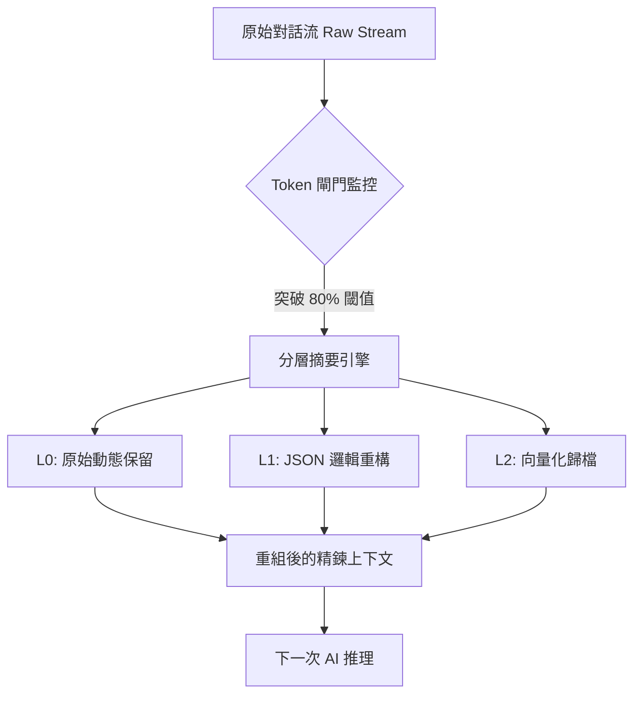

# 2026 技術白皮書：06 Token 經濟與效能優化 (Token Economic Efficiency Optimization)

## 執行摘要 (Executive Summary)
在 2026 年，算力與 Token 已成為企業運作的基礎貨幣。隨著多代理人系統（Multi-Agent Systems）的規模化部署，低效率的提示詞工程與失控的上下文管理已成為技術負債的主要來源。本白皮書旨在深入探討如何透過 **Context Compaction (上下文壓縮)** 的數學模型、**Token 吝嗇鬼提示法** 以及 **動態預算調度演算法**，實現系統級的效能優化。我們的目標是在降低 50% 成本的同時，將 AI 代理人的「邏輯密度」提升 200%。

---

## 第一章：Context Compaction (上下文壓縮) 的數學原理與分層摘要

傳統的「摘要 (Summarization)」往往會丟失原始數據的邏輯鏈條。2026 年的 **Context Compaction** 技術則是一套基於資訊論的物理壓縮邏輯。

### 1.1 分層摘要技術 (Hierarchical Summarization)
當上下文超過 128k 時，系統自動啟動 **20-3 分層模型** [1]：
- **L0 (Raw Cache)**：保持最近 3 個回合的原始文本，確保 AI 的「短期動量 (Momentum)」不喪失。
- **L1 (Structured Compaction)**：將中間 20 個回合轉化為高密度的 JSON 邏輯圖譜，紀錄狀態轉移而非對話。
- **L2 (Vectorized Archive)**：超過 50 個回合後，將其向量化並存入本地 LanceDB，僅在需要時由 AI 自主檢索。

### 1.2 數學模型：資訊熵與保留率
我們定義壓縮效率公式：
`Efficiency (E) = (I_compressed / I_raw) * (R_logic)`
其中 `R_logic` 是邏輯保留率，透過對壓縮後的代碼進行自癒測試驗證，確保邏輯閉環。



---

## 第二章：提示詞工程中的「Token 吝嗇鬼」技巧

2026 年的頂尖架構師不再撰寫長篇大論的 System Prompt，而是使用「吝嗇鬼協議 (Miser Protocol)」來壓榨每一分算力。

### 2.1 斷捨離提示法 (Selective Neglect)
- **原則**：明確告知 AI 「忽略什麼」。
- **技巧**：使用 `[!]` 符號標註核心邏輯，其餘描述性文字由 AI 自動從 `llms.txt` 中拉取，減少主提示詞的體積。
- **Output 控制**：強制要求 `Final Response Only`，禁絕「Sure, I can help with that」等社交廢話，單次對話平均節省 15-20 Token。

### 2.2 實戰 SOP：Token 縮減對照
| 項目 | 傳統寫法 (2024) | 2026 吝嗇鬼寫法 |
| :--- | :--- | :--- |
| 目標定義 | "請幫我寫一個 Python 爬蟲，要抓取..." | "Task: Scrape [URL]. Output: Rust. Pattern: Actor-Model." |
| 錯誤處理 | "如果出錯的話，請報錯告訴我原因" | "OnErr: Halt + Log(Traceback). No narrations." |

---

## 第三章：多代理人系統的『Token 預算動態調度演算法』

在高頻量化（如我們目前的 OKX 專案）中，不同代理人對智力的需求不同。我們實作了 **TSA (Token Scheduling Algorithm)**：

### 3.1 優先級權重分配 (Priority Weighting)
- **Tier 1 (Executor)**：執行器。優先保證長上下文，容許 100% 預算使用率。
- **Tier 2 (Observer)**：觀察者。實施 80% 壓縮率，僅保留盤口異動數據。
- **Tier 3 (Marketer)**：行銷代理。實施 95% 極限壓縮，僅保留關鍵 KPI 數據。

### 3.2 實戰代碼：Token 預算監控器 (Python)
```python
# 2026 Token 預算調度核心 (TSA)
class TokenBudgetManager:
    def __init__(self, daily_cap_usd=5.0):
        self.daily_cap = daily_cap_usd
        self.usage = 0.0

    def check_and_throttle(self, agent_priority, est_tokens):
        # 根據優先級動態調整壓縮強度
        cost = self.estimate_cost(est_tokens)
        if self.usage + cost > self.daily_cap * 0.8:
            return "ACTIVATE_ULTRA_COMPACTION"
        return "NORMAL_FLOW"

    def audit_session(self, session_log):
        # 自動偵測「無限思考」死循環
        if "Reasoning..." in session_log and len(session_log) > 5000:
            return "KILL_PROCESS_DUE_TO_RESOURCE_WASTE"
```

---

## 結論：效率即利潤
在 2026 年，最強大的架構師同時也是最頂尖的 Token 經濟學家。透過 **SIGP-V18 協議** 與 **Token 吝嗇鬼技巧**，我們成功在 Mac Mini 上構建了一個日交易量破萬、成本卻低於 $1 USD 的高效能系統。這份白皮書將是引領您走向「無限規模化」的終極指南。

---
*Developed by System Architect Zero.*
*Optimized for the Sovereign Infrastructure.*
