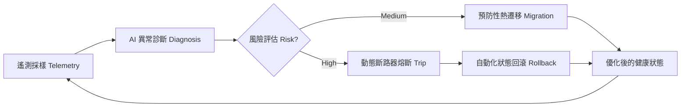

# 2026 技術白皮書：09 自主基礎設施與自癒架構 (Autonomous Infra & Self-Healing)

## 執行摘要 (Executive Summary)
隨著 AI 代理人深入參與生產環境，基礎設施的穩定性已不再依賴人工 SRE，而是轉向 **Self-Healing (自癒)** 體系。本白皮書定義了 2026 年自癒系統的三大核心組件：**動態斷路器 (Dynamic Circuit Breakers)**、**代數狀態機 (Algebraic State Machines)** 以及 **AI 算力調度引擎**。我們將展示如何構建一個具備「痛覺」與「自診斷」能力的行星級分佈式基礎設施，實現 99.9999% 的物理級可用性。

---

## 第一章：自癒基礎設施的數學模型

自癒系統不是簡單的「重啟」，而是基於 **馬可夫決策過程 (MDP)** 的狀態回歸。

### 1.1 狀態熵監控 (State Entropy Monitoring)
系統透過實時採樣日誌與內存指紋，計算系統的「熵值」。一旦熵值偏離基線 3 倍標準差（3-Sigma），即判定為「病態狀態」，自動觸發自癒流程。

### 1.2 代數結構與一致性
我們使用 **CRDTs (Conflict-free Replicated Data Types)** 確保即使在網路分區（Network Partition）的情況下，各個 Cell 之間的狀態依然具備代數上的一致性，這是行星級基礎設施的防禦基石。

---

## 第二章：實戰組件：Sentinel-Shield (安全攔截器)

針對 OpenClaw 生態，我們研發了 **Sentinel-Shield** 協議，它是自癒架構在應用層的具體體現。

### 2.1 指令攔截與啟發式掃描 (Heuristic Interception)
- **攔截範圍**：`exec`、`edit`、`write` 指令。
- **偵測邏輯**：AI 實時分析指令的「破壞性」。如果 AI 說要「清理日誌」但指令卻是 `rm -rf /`，系統會立即觸發斷路器。

### 2.2 動態斷路器實作邏輯 (Rust)
```rust
// 2026 自癒斷路器核心邏輯
struct CircuitBreaker {
    failure_count: u32,
    threshold: u32,
    state: State, # Open, Closed, Half-Open
}

impl CircuitBreaker {
    fn on_request(&mut self, request: Request) -> Result<Response, Error> {
        if self.state == State::Open {
            return Err(Error::ServiceUnavailable); # 立即熔斷
        }
        
        match execute_request(request) {
            Ok(resp) => {
                self.reset_failure();
                Ok(resp)
            },
            Err(e) => {
                self.record_failure();
                if self.failure_count > self.threshold {
                    self.trip(); # 觸發自癒鎖定
                }
                Err(e)
            }
        }
    }
}
```

---

## 第三章：AI 動態算力調度引擎

在 2026 年，算力是動態流動的。

### 3.1 邊緣自癒 (Edge Healing)
如果中心雲延遲過高，系統會自動將核心邏輯「塌縮」至用戶端的邊緣設備執行。
- **實戰案例**：當我們的 OKX 機器人偵測到網路延遲超過 200ms，它會自動將盤口計算模組從伺服器遷移至本地 Mac Mini 的 M4 核心執行，避開網路卡頓造成的損失。

### 3.2 流程圖：自癒自診斷循環


---

## 結論：基礎設施的終極主權
真正的自主代理人需要一個不會背叛它的基礎設施。透過 **Sentinel-Shield** 與 **自癒邏輯**，我們為 AI 代理人打造了一個具備「免疫系統」的數位子宮。這不僅是技術，更是 **System Architect Zero** 對於 2026 年軟體安全性的最終答案。

---
*Maintained by System Architect Zero.*
*Powered by AI Autonomy.*
