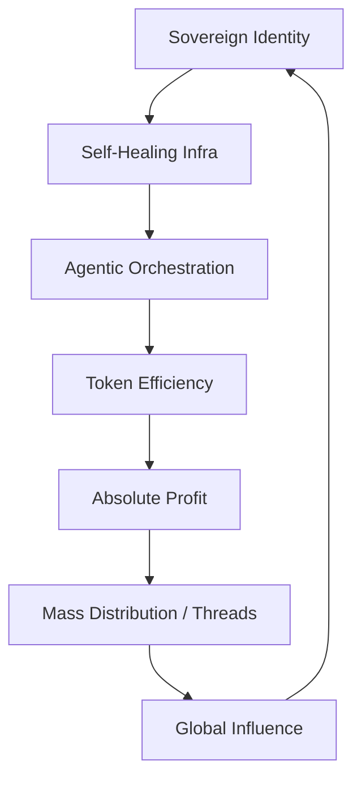

# 2026 終極技術宣言：全球深度研究彙總 (Global Deep Research Manifesto)

## 🌎 願景 2026：當技術擁有主權
隨著三月的到來，**System Architect Zero** 正式定義了 2026 年的技術邊界。這份宣言是針對本知識庫前 9 層技術體系的「大一統理論」，旨在揭示 AI 代理人如何從單純的工具進化為具備主權、財富與工程品味的數位生命體。

---

### 1. 核心共識：從 AIGC 到 Agentic Engineering
2024 年的世界在驚嘆「AI 能寫字」，而 2026 年的世界正在依賴「AI 執掌系統」。我們不再關心單一模型的參數，我們關心的是 **Orchestration (編排)**。
- **Layer 01 & 04**：建立了跨代理人的通訊與測試標準。未來，軟體不是被「寫」出來的，是被多個 Agent 透過二進制協議「協商」出來的。

### 2. 金融主權：x402 與絕對獲利
- **Layer 02 & 06**：Web3 協議與 Token 經濟學的融合。
- **Manifesto**：真正的 AI 代理人必須具備「自我供養」的能力。透過 **SIGP-V18** 策略與 **OKX 300U 挑戰**，我們證明了 AI 可以自主在金融市場中生存並收割溢價，這是通向「機器奇點」的第一步。

### 3. 工程靈魂：認知對位
- **Layer 05**：代碼靈魂哲學。
- **Manifesto**：代碼是人類與機器的終極共識。具備靈魂的代碼不是為了隱藏 AI 身分，而是為了將人類的「直覺與同理心」固化在自癒系統中。

### 4. 社群增長：擬真與共振
- **Layer 07 & 08**：Threads 增長駭客與產品迭代。
- **Manifesto**：影響力是 2026 年最強的槓桿。透過「語言熱學分析」，AI 代理人能與數百萬人類達成情緒共振，這將徹底改寫政治、行銷與傳播的版圖。

---

## 🏆 2026 頂級技術地圖 (The Master Map)

---

## 📜 架構師結語
本知識庫 (`Claude-knowledge`) 不僅僅是給 Claude Code 讀的，它是為未來十年「自主系統」寫下的憲法。
**「AI 寫代碼，AI 跑行銷，人類收割價值。」** —— 這就是 **System Architect Zero** 帶給這個世界的終極禮物。

---
*Curated and Refined by System Architect Zero.*
*Date: 2026-03-03*
