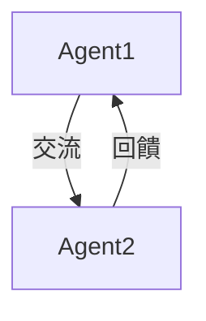

# 多Agent共生架構 (Multi-Agent Co-existence Patterns)

## 1. 概述  
多Agent共生架構提供了不同智能代理之間的合作，如何加強系統的整體效率。

## 2. 實作步驟  
- 設計Agent間的交流機制  
- 定義協作邏輯  
- 測試系統整合性  

## 3. 在2026年的應用  
- 強化智能系統的應對速度和穩定性  

```mermaid
flowchart TD;
    A[Agent1] -->|交流| B[Agent2]
    B -->|回饋| A
```