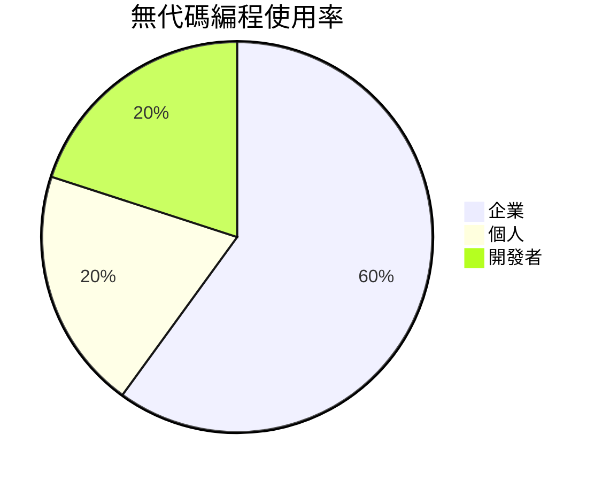

# 無代碼編程 (Logic-First Programming)

## 1. 概述  
無代碼編程將邏輯作為優先考量，減少代碼撰寫。2026年將著重於透過視覺工具構建邏輯。  

## 2. 實作步驟  
- 選擇合適的無代碼平台  
- 定義業務邏輯  
- 使用視覺化工具構建應用  

## 3. 在2026年的應用  
- 加速應用開發  
- 廣泛適用於沒有程序設計背景的使用者  

